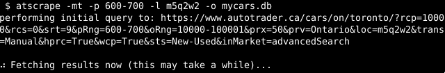
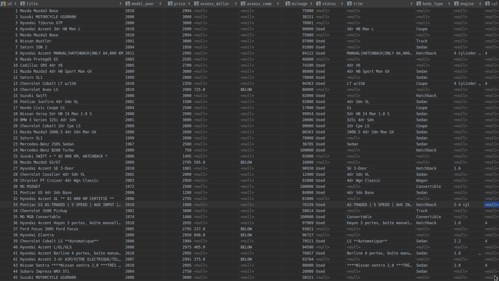

Unofficial Autotrader.ca Scraper
---------------

This program will scrape the `autotrader.ca` website and dump some general information about results
to a Sqlite database.  This will include things that are typically not contained in the search parameters
of the site.  For example you can order by dealer to plan visiting as many as you can in one trip.  

Data captured includes model, car brand, price, mileage.  It tries some fuzzy terms in order to determine
whether the vehicle posted has a backup camera, has ABS and whether the seller mentions that there is only 
one previous owner.

I originally made this program in order to find trends in used car postings in my area as well as to satisfy my basic
requirements in a car.  However I ended up abandoning this project entirely. The fact that insurance claims are 
often obscured from non commercialized interfaces (ie carfax) basically leads to a hidden variable that explains
most "well priced" used vehicles I have found. I also noticed that all high volume official dealerships in my area did not 
use autotrader.  

# Prereqs

Tested on Debian 10, with Python 3.6

# Install

Simply run

```
./install.sh
```

# Usage

Let us say you live around the postal code M5Q2W2 and want a Manual transmission car priced from 600-3000 dollars 
and want to create a mycars.db output file.

Simply type into terminal:

```
atscrape -mt -p 600-3000 -l M5Q2W2 -o mycars.db
```

and after it fetches the results (which can take some time) you will have a `mycars.db` SQLite database with all 
of the details.



An example of the output data would look like this:



There is a sample of scripts you can run in the `sql` directory against the database.

## Note:  This is not actively maintained, it was just a quick weekend project.

**Obviously not affliated with autotrader.ca in anyway**

